<a href="https://adbrt.com">
  
</a>

<p align="center">
  <a href="https://adbrt.com"></a>
  <a href="https://github.com/sakuga-software"></a>
  
  
</p>

```text
> PILOT FILE ............................................. MHEAUS
  role      freelance fullstack web developer
  base      Bordeaux, France
  unit      founder of @sakuga-software
  missions  web platforms for private organisations, from first sketch to production
  systems   TypeScript · React · Node.js · Docker · self-hosted infra
```





<table>
  <tr>
    <td width="50%"><a href="https://github.com/Mheaus/adbrt.com"></a></td>
    <td width="50%"><a href="https://github.com/Mheaus/claude-skills"></a></td>
  </tr>
  <tr>
    <td width="50%"><a href="https://github.com/Mheaus/dotfiles"></a></td>
    <td width="50%"><a href="https://github.com/Mheaus/three-js-experiment"></a></td>
  </tr>
</table>

<p align="center"><sub>LAUNCH SEQUENCE COMPLETE · 発進</sub></p>
